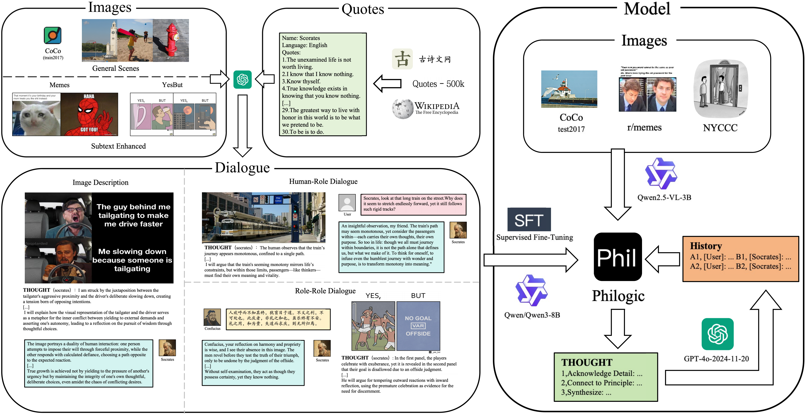

# PhiLogic: A Reasoning-Augmented Framework for Multimodal Role-Playing Agents

**Our paper "PhiLogic: A Reasoning-Augmented Framework for Multimodal Role-Playing Agents" is currently under review. Some processes will be made public upon acceptance.**



[📦 [**Dataset**](https://huggingface.co/datasets/BB265/PhiLogic_dataset/)]

This is the official implementation for the paper **"PhiLogic: A Reasoning-Augmented Framework for Multimodal Role-Playing Agents"**.

PhiLogic is a novel reasoning-augmented framework for Multimodal Role-Playing Agents. It addresses the lack of logical consistency in existing models when imitating complex roles like philosophers. PhiLogic enhances logical structure by integrating the Chain-of-Thought (CoT) methodology with Supervised Fine-Tuning (SFT).

## 🚀 Framework Architecture

PhiLogic employs a modular, two-stage architecture that decouples visual perception from dialogue generation:

1.  **Visual Perception Module:** Uses **Qwen2.5-VL-3B** to interpret the input image (I) and generate a rich textual description ($T_{desc}$), engineered to capture potential subtext, emotions, or satirical intent.
2.  **Reasoning and Dialogue Module:** Uses an SFT-optimized **Qwen3-8B**. This module takes $T_{desc}$, dialogue history (H), and the philosopher's profile (P) to first generate an explicit Chain-of-Thought ($C_T$) and then formulate the final, in-character response (R).

## 📦 Benchmark and Dataset

To train and evaluate PhiLogic, we constructed a [100K-sample multimodal dataset](https://huggingface.co/datasets/BB265/PhiLogic_dataset/tree/main). Our Dialogue Corpus was generated using **GPT-40-2024-11-20**.

The corpus is centered on visual content, and each dialogue is paired with its generation's Chain-of-Thought (CoT) record. It contains three data types:

* (a) Image Descriptions: The model generates a detailed textual description for a given image.

* (b) Human-Role Dialogue: Simulates multi-turn conversations between a human user and an agent role-playing as a philosopher.

* (c) Role-Role Dialogue: Simulates multi-turn conversations between two agents role-playing as different philosophers.

Our data sources include:

* **Quote Corpus:**
    * [Quotes- 500k](https://www.kaggle.com/datasets/manann/quotes-500k)
    * [gushiwen.cn (古诗文网)](https://www.gushiwen.cn/)
    * [Wikipedia](https://en.wikipedia.org/)

* **Image Collection:**
    * **Training Set:**
        * [COCO-train2017](https://cocodataset.org/)
        * [MemeCap](https://arxiv.org/abs/2305.13703)
        * [YesBut](https://arxiv.org/abs/2409.13592)
    * **Test Set:**
        * [COCO-test2017](https://cocodataset.org/)
        * [r/memes subreddit](https://www.kaggle.com/datasets/nikitricky/memes)
        * [The New Yorker Cartoon Caption Contest (NYCCC) Dataset](https://arxiv.org/abs/2406.10522)

## 📊 Evaluation

We introduce **PhiLogic-Judge**, an LLM-as-a-Judge methodology using **Claude Sonnet 4** as the evaluator. Evaluation spans four key dimensions: Role Adherence, Logical Cohesion, Cross-modal Understanding, and Philosophical Grounding.

### Scoring Rubric

| Metric | Pts. |
| :--- | :--- |
| **1. Role Adherence (RA)** | **20** |
| 1a. Linguistic Style Consistency | 10 |
| 1b. Personality Consistency | 10 |
| **2. Logical Cohesion (LC)** | **30** |
| 2a. Stance Consistency | 10 |
| 2b. Contextual Relevance | 5 |
| 2c. Response Diversity | 5 |
| 2d. Argumentative Flow | 10 |
| **3. Cross-modal Understanding (CU)** | **20** |
| 3a. Visual-Text Alignment | 5 |
| 3b. Visual Subtext Understanding | 15 |
| **4. Philosophical Grounding (PG)** | **30** |
| 4a. Philosophical Coherence | 15 |
| 4b. Philosophical Subtlety | 15 |
| **Overall Score** | **100** |

### Evaluation Artifacts

- **Raw judge outputs:** `eval/evaluation_answer/*.jsonl` contains Claude Sonnet 4 evaluations for each philosopher–image pair and model (`Gemma-3-12B`, `Gemma-3-4B`, `PhiLogic`, `PhiLogic-zero_shot`, `Qwen2.5-VL-72B`, `deepseek-r1-250528`, `gemini-2.5-pro`, `qwen3-235b-a22b`).
- **Summary statistics:** `eval/evaluation_result/evaluation_statistics.csv` aggregates the judge scores across the rubric dimensions for reporting and visualization.

## 📦 Data Structure

All data can be downloaded and organized according to the following folder structure.

```bash
PhiLogic
├── assets
│   └── philogic.png
├── eval
│   ├── evaluation_answer
│   │   ├── evaluation_answer_deepseek-r1-250528.jsonl
│   │   ├── evaluation_answer_gemini-2.5-pro.jsonl
│   │   ├── evaluation_answer_Gemma-3-12B.jsonl
│   │   ├── evaluation_answer_Gemma-3-4B.jsonl
│   │   ├── evaluation_answer_PhiLogic-zero_shot.jsonl
│   │   ├── evaluation_answer_PhiLogic.jsonl
│   │   ├── evaluation_answer_Qwen2.5-VL-72B.jsonl
│   │   └── evaluation_answer_qwen3-235b-a22b.jsonl
│   └── evaluation_result
│       └── evaluation_statistics.csv
├── finetune
│   ├── ds_config_zero2.json
│   ├── ds_config_zero3.json
│   └── finetune_ds.sh
├── finetune.py
├── LICENSE
├── README.md
└── requirements.txt
```

## 🛠️ Environment Requirements

The environment requirements are consistent with [MMRole](https://github.com/YanqiDai/MMRole).
- python 3.8 and above
- pytorch 1.12 and above, 2.0 and above are recommended
- CUDA 11.4 and above are recommended (this is for GPU users)

Make sure you meet the above requirements, and then install the dependent libraries.

```bash
pip install -r requirements.txt
```

## 📜 Citation
Our paper is currently under review. If you use our code or framework, please cite this repository:

```bibtex
@misc{philogic_github_2025,
  author = {PhiLogic Team},
  title = {PhiLogic: A Reasoning-Augmented Framework for Multimodal Role-Playing Agents},
  year = {2025},
  publisher = {GitHub},
  journal = {GitHub repository},
  howpublished = {\url{[https://github.com/BB265/PhiLogic](https://github.com/BB265/PhiLogic)}}
}
```